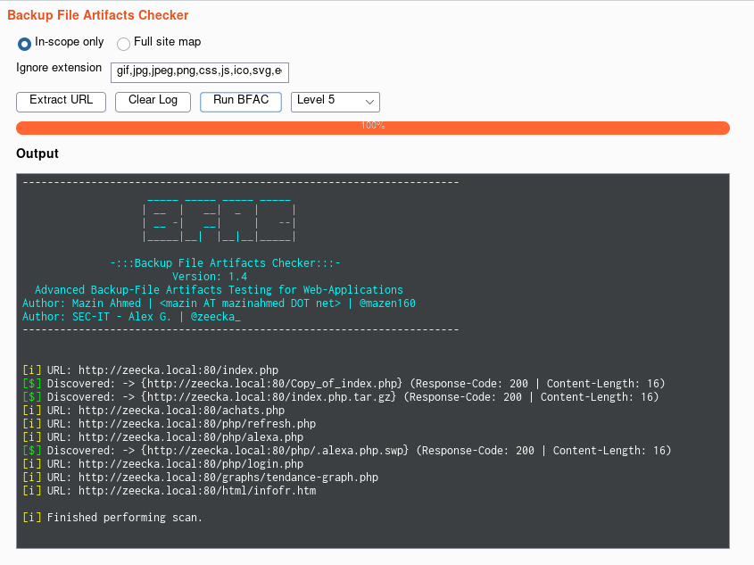
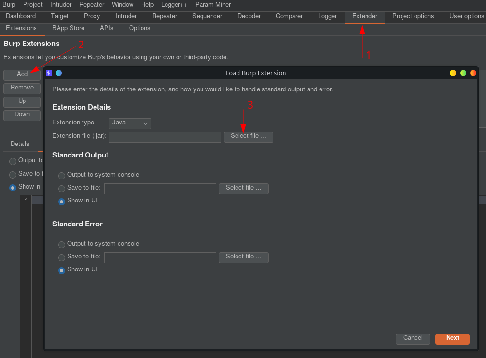
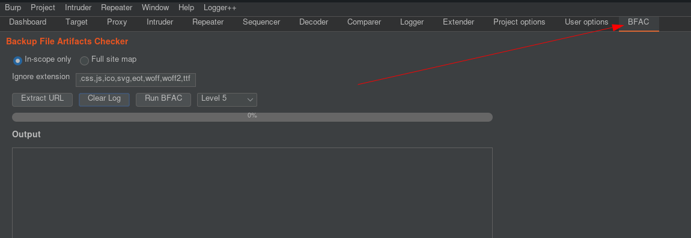
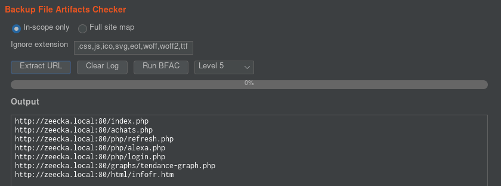
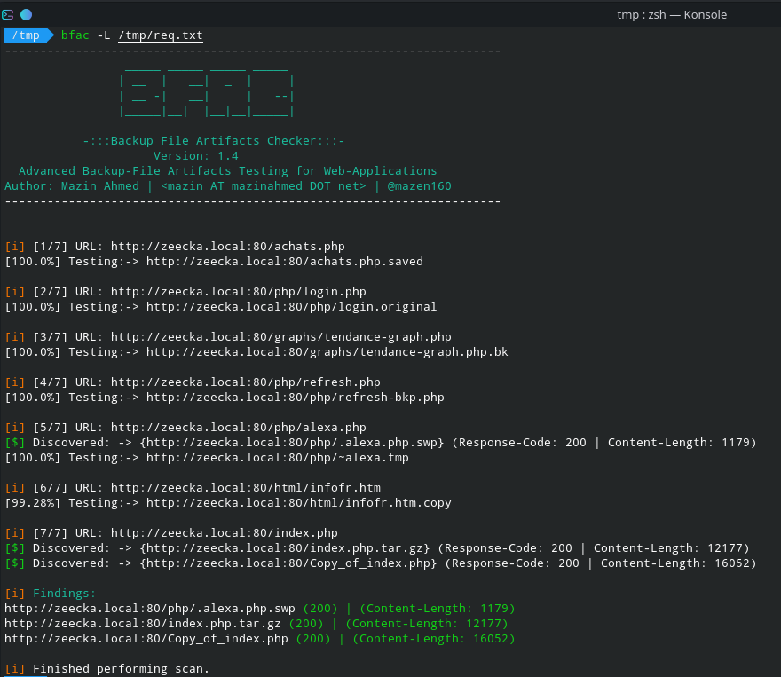
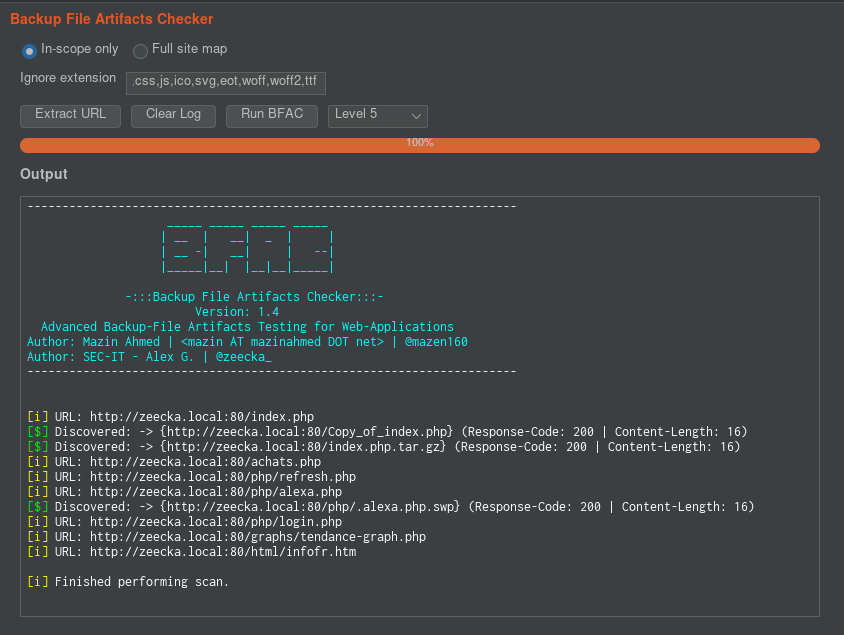

# BFAC - Burp Extension

Burp Extension for [BFAC][bfac] (Advanced Backup-File Artifacts Testing for Web-Applications).

## What is BFAC - Burp Extension ?

Backup files are too often overlooked by web application auditors. With the objective of democratizing the backup file tests and integrating these tests into the most used tool for web auditors, SEC-IT auditors worked on the integration of the BFAC checks as a BurpSuite plugin.

[BFAC][bfac] is an automated tool that checks for backup artifacts that may disclose the web-application's source code. The artifacts can also lead to leakage of sensitive information, such as passwords, directory structure, etc. This a tool provided by [@mazen160][mazen160].

[BurpSuite](https://portswigger.net/burp) is a well known pentesting tool used in web application assessment.

The pluggin is written in Java for better integration with BurpSuite Extender API.

## How to install ?

Download [BFAC.jar][jar] on your computer. Then import the jar file as a Burp plugin :

0. Open Burp
1. Click on the "Extender" tab
2. Click on the "Add" button
3. Set extension type to Java and load [BFAC.jar][jar] by clicking on "Select file..."

Once loaded, you should see a "BFAC" tab :

## How to use BFAC plugin ?

BFAC Burp Extension is designed to look for backup files from the Burpsuite [sitemap].
Therefore, **it is better to run BFAC Burp extension when the sitemap is full enough**.
Sitemap fulfillment will not be covered here, however it can be accomplish using active scanners.

Once your sitemap is full, you have 2 options.

### The old way 

[BFAC][bfac] original tool may provide interesting options that are not provided by this extension. That why you can extract interesting URLs from the sitemap using the "Extract URL".

Then, you only have to provide the extracted URLs to the [BFAC][bfac] tool :

### The Burp way

If you do not have [BFAC][bfac] on your computer or want to gain time, you can just click on "Run BFAC" to run a Java implementation of BFAC :

## Acknowledgments

The [Site-map-extractor][sitemapextactor] BurpSuite plugin written by [@swright573][swright573] has been a great source of inspiration and helped us to better understand BurpSuite Extender API from a "sitemap" point of view.

[bfac]:https://github.com/mazen160/bfac
[mazen160]:https://twitter.com/mazen160
[sitemapextactor]:https://github.com/swright573/site-map-extractor
[swright573]:https://github.com/swright573
[jar]:bin/BFAC.jar
[sitemap]:https://portswigger.net/burp/documentation/desktop/tools/target/site-map